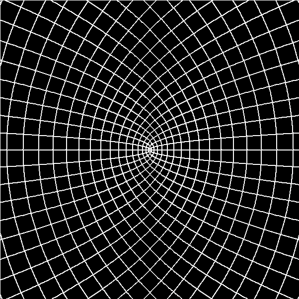
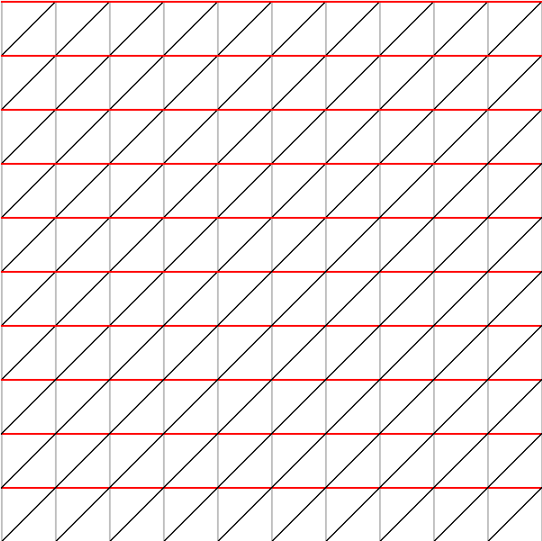
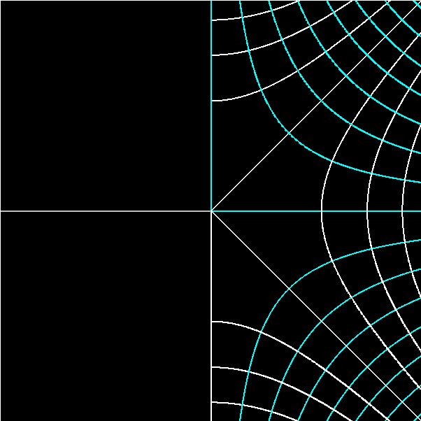

# Transformations of the complex plane

Keep options separate, e.g. ''python3 main.py -f 'z\*\*2' -i''.

    -f 'cmath.sqrt(z**3)'
        Apply function
    
    -m "3 1 4 1"
        Linear transformation by matrix (a11, a12; a21, a22) after
        applying function
    
    -z 25
        Zoom (100 => no zoom)  
    
    -g 10
        Gap between gridlines
    
    -r 0.1
        Resolution (smaller => smoother curves).
    
    -O
        Hide original gridlines
    
    -M
        Monochrome: no colours to differentiate lines that were
        originally horizontal from those that were vertical
    
    -i
        Invert colours

## Examples

	python3 main.py -f 'z**2' -O -M -i -z 0.01

	python3 main.py -m '1 1 0 1'

	python3 main.py -f 'cmath.sqrt(z)' -O -i -z 50 -r 0.1

